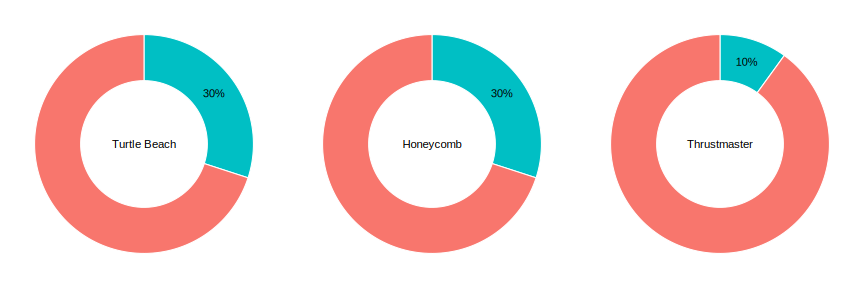
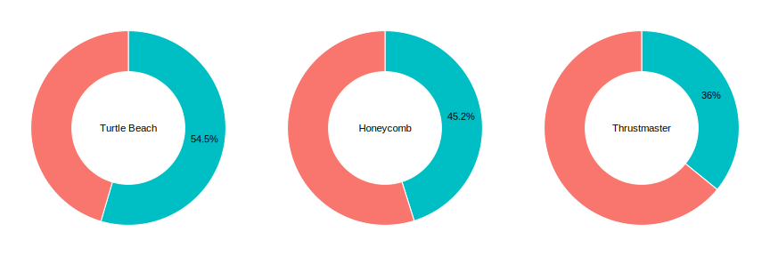
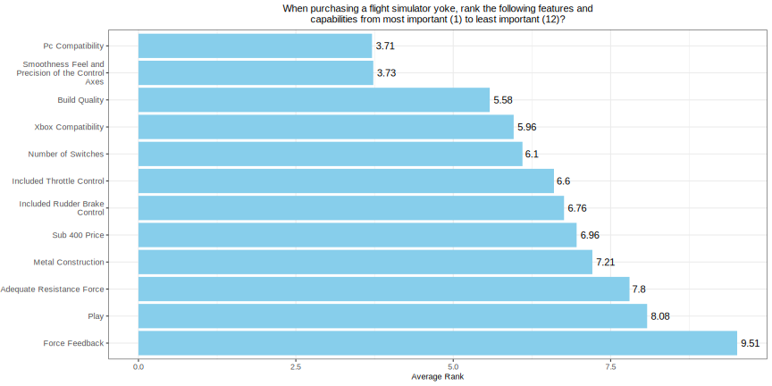
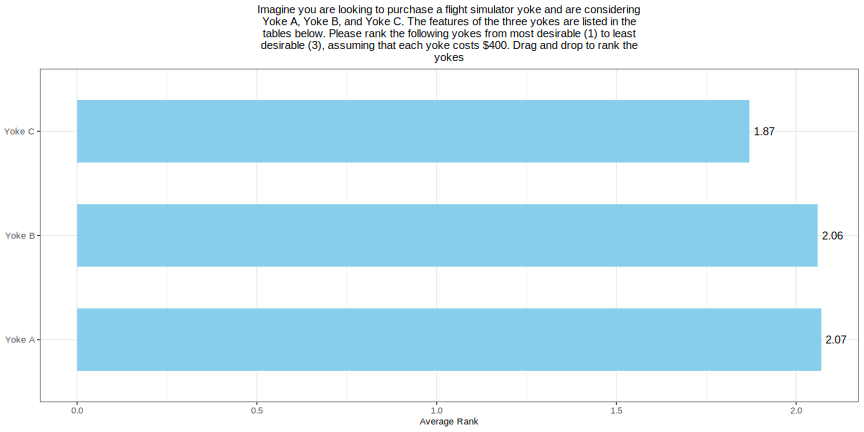
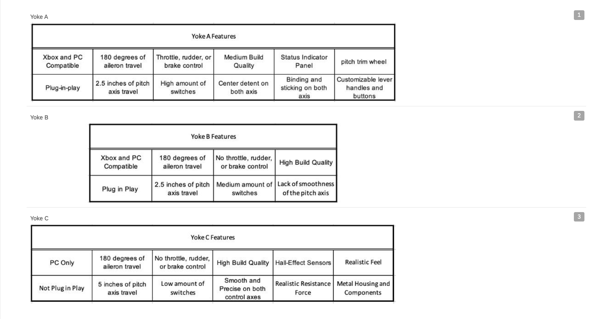

# Market Validation Report: Flight Simulation Yoke Controller

## Background

This repository summarizes findings from an exploratory analysis on the market feasibility of introducing a new product offering in the flight simulation yoke controller market. 

The proposed product offers one key advantage over current market options: **enhanced perceived feel, smoothness, and precision of yoke movement—all at a price point under $400.**

The main competitors identified for this analysis are the **Turtle Beach VelocityOne**, **Honeycomb Alpha XPC**, and **Thrustmaster TCA Boeing Edition**.

To explore the viability of this product, we focused on answering three key research questions:
- **RQ1: Do users of competitors flight simulation yokes perceive issues with feel, smoothness, or precision?**
- **RQ2: What value do users of competitors place on the feel, smoothness, and precision of a flight yoke relative to other features?​**
- **RQ3: How desirable is the proposed product compared to its primary competitors?**

## Conclusions & Key Findings 

### *RQ1: Do users of competitors flight simulation yokes perceive issues with feel, smoothness, or precision?*

- **Between 30% and 55%** of customer reviews (30%) and survey respondents (45–55%) for the **Turtle Beach** and **Honeycomb** yokes reported concerns related to the feel, smoothness, and precision of the yoke mechanism.

- For the **Thrustmaster** yoke, these issues were reported **less frequently**: approximately 10% of customer reviews and 36% of survey respondents indicated similar concerns.

- Across both data sources, the **Thrustmaster yoke consistently showed higher satisfaction** regarding smoothness, which is consistent with its **pendular yoke mechanism**—a design less susceptible to the friction or stiffness issues common in linear mechanisms.

- These findings suggest that the **proposed product competes more directly** with the **Honeycomb** and **Turtle Beach** yokes than with the Thrustmaster, both because of its similar linear mechanism and its appeal to a general aviation market (as opposed to Thrustmaster’s niche targeting of Boeing aircraft enthusiasts).

- Reports of dissatisfaction were **higher in the survey** than in customer reviews across all products. This discrepancy likely reflects the difference between **prompted responses** in the survey, which asked users to reflect critically on the pitch mechanism, and **unprompted reviews**, which highlight only the most salient or bothersome product issues.

### *RQ 2: Determine the value users place on the feel, smoothness, and precision of a flight yoke relative to other features.​*
- **Yoke Smoothness, Feel, and Precision** and **PC Compatibility** were the two **highest-valued** features for desirability, with average rankings of 3.73/12 and 3.71/12, respectively.

- Respondents’ strong preference for **PC Compatibility** aligns with our assumption that the sample consisted primarily of **enthusiast users**, who often use PCs more than gaming consoles for flight simulation. This could position **Yoke Smoothness, Feel, and Precision** as the **most important** feature beyond platform compatibility.

- However, the survey question **did not capture the intensity of trade-offs**, that is, how much smoothness or precision users are willing to sacrifice in favor of gaining other features. This **limits our understanding** of the strength of user preferences when features are in conflict.

- **Lower-valued** features included **Force Feedback** (9.51/12) and **Plug-and-Play Setup** (8.08/12), suggesting that users view these as **luxury or non-essential features**, rather than core purchase drivers.

- **Adequate Resistance Force**, a feature that contributes to flight realism (in addition to **force feedback**), was ranked 7.80/12. This may support the idea that **realism-enhancing features are perceived as more luxury items**.

- **All other features** in the analysis were ranked on average between **5/12 to 7/12**. Some key takeaways:
  - **Build Quality** received an average rank of **5.58/12**, while **Metal Construction** was ranked higher at **7.21/12**. This suggests that users may be **comfortable with plastic construction as long as the overall build quality feels solid**.
  - A **sub-$400 price point** received an average rank of **6.96/12**, indicating that users may be **willing to pay more if the product delivers on higher priority features**.

- While this ranking question helped identify feature preferences, it did **not capture** the **degree to which users are willing to trade off one feature for another**. For example, it remains unclear what level of improvement in pitch smoothness would justify sacrificing other features. Future research could apply methods to quantify the intensity and thresholds of these trade-offs, providing a clearer picture of user priorities.

  
### *RQ 3: Assess the comparative desirability of the proposed product against its primary competitors.​*
- Users ranked **Yoke A (Turtle Beach)**, **Yoke B (Honeycomb)**, and **Yoke C (Proposed Product)** similarly, with **average rankings near 2 out of 3**, suggesting a perception of **competitive parity**.

- The **Proposed Product** ranked the highest overall with an average of **1.87/3**, slightly ahead of both competitors. This indicates that, at least at a surface level, the proposed product would be **competitive in the this market landscape**.

## Limitations

- **Exploratory Findings:** Findings are exploratory and may not be representative of the broader market.

- **Subjectivity of yoke quality:** The perceived smoothness, feel, and precision of a yoke is subjective and vary by user. Differences in this quality are difficult to describe explicitly when creating measures.

- **Does Not Reflect Post-Review Product Changes:** The analysis reflects customer experiences tied to specific product iterations at the time of the review. Subsequent updates or redesigns are not captured.

- **Instrumentation Bias:** Due to a Qualtrics configuration issue, feature and yoke ranking questions were not randomized, possibly biasing responses based on the default item order.

### *Sampling Bias*
  - Product Review data is drawn primarily from Amazon via web scraping. Amazon’s platform only displays up to 100 reviews per filter, which may skew sample representation.
  - Customers posting reviews are self-selecting, and those with strong negative or to a lesser degree positive opinions are more likely to leave reviews. This may result in bias toward more extreme sentiment.  
  - The survey sample is limited to Reddit users from r/flightsim, which likely overrepresents niche and enthusiast flight simulator users rather than casual consumers
  - Respondents were self-selected and may have been influenced by the incentive to participate, introducing potential bias.

  
  
## Methods & Data Processing
Our methodological approach to answering these questions included data sources in customer product reviews and survey data

### *Product Reviews*
Web-scraped 306 customer reviews (3 stars or under) from Amazon, Walmart, Best Buy and other popular retailers​

Sample breakdown for each yoke:​
- Turtle Beach Velocity One (n=174) ​
- Honeycomb Aeronautical XPC (n=82)​
- Thrustmaster TCA Boeing (n=50)

For more detailed information on the analysis plan and data processing, please review this code file and readme:
[Product Review Data Processing & Analysis](https://github.com/sufiyan-syed0921/market-validation-fsy/tree/main/product_reviews)

### *Survey* 
Surveyed approximately 300 yoke users on the r/flightsim subreddit using Qualtrics​. Users who took the survey were entered into a raffle for a $100 Steam gift card​. 

Responses were removed to form the final analysis sample for two key reasons: 
- **Yoke Ownership:**
Users who do not own a flight yoke, or those who quit the survey after indicating yoke ownership, were removed.
- **Inconconsitent Location Responses:**
Respondents were asked if they are local to the SF Bay Area. If so, respondents were further asked if they would be interested in participating in an in-person user study. We received a significant number of responses claiming to be local to the SF Bay Area while having IP addresses far outside the SF Bay Area which raised concerns of untruthful responses. These responses were removed from the sample.​

After these filters, the post-processed sample size for the survey data was 157. 

For more detailed information on the analysis plan and data processing, please review this code file and readme:
[Survey Data Processing & Analysis](https://github.com/sufiyan-syed0921/market-validation-fsy/tree/main/survey)

## Results 

### *RQ 1: Understand whether users of flight simulation yokes perceive feel, smoothness, and precision issues in current market offerings*

   <h4>Product Reviews:  Percentage of reviews (3 stars or lower) that mention pitch smoothness and related features as an issue</h4>

  

  <h4>Survey Question:  Do you find the smoothness and feel of the pitch axis an issue in your current yoke?</h4>

### *RQ 2: Determine the value users place on the feel, smoothness, and precision of a flight yoke relative to other features*

  <h4>Average Feature Ranking  Survey Question - When purchasing a flight simulator yoke, rank the following features and capabilities from most important (1) to least important (12)</h4> 

### *RQ 3: Assess the comparative desirability of the proposed product against its primary competitors*​

 
   <h4>Average Product Ranking  Survey Question - Imagine you are looking to purchase a flight simulator yoke and are considering Yoke A, Yoke B, and Yoke C. Please rank the following yokes from most desirable (1) to least desirable (3), assuming that each yoke costs $400</h4> 

   **Product Features in Survey Question** 

