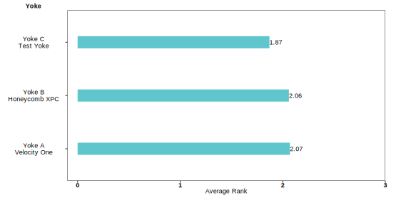

# Market Validation Report: Flight Simulation Yoke Controller

## Background

This repository aims to summarize research results from an exploratory analysis on the outcome of introducing an additional product offering in the flight simulation yoke controller market.The proposed product has one main advantage over current market offerings, which we aim to test: an increased perceived feel, smoothness, and precision of yoke movement at a price point under $400. Our main product competitors we outlined for this analysis is the Turtle Beach: VelocityOne, Honeycomb XPC, and the Thrustmaster TCA Boeing. Given this, we set out to answer 3 key questions in an attempt to validate a market for this product:

##### *RQ 1: Understand whether users of flight simulation yokes perceive feel, smoothness, and precision issues in current market offerings.​*
##### *RQ 2: Determine the value users place on the feel, smoothness, and precision of a flight yoke relative to other features.​*
##### *RQ 3: Assess the comparative desirability of the current product against its primary competitors.​*

## Methods & Data Processing
Our methodological approach to answering these questions included data sources in customer product reviews and survey data

### Product Reviews 
Web-scraped 306 customer reviews (3 stars or under) from Amazon, Walmart, Best Buy and other popular retailers​

Sample breakdown for each yoke:​
- Turtle Beach Velocity One (n=174) ​
- Honeycomb Aeronautical XPC (n=82)​
- Thrustmaster TCA Boeing (n=50)

For more detailed information on the analysis plan and data processing, please review this code file and readme:
[Product Review Data Processing & Analysis](https://github.com/sufiyan-syed0921/market-validation-fsy/tree/main/product_reviews)

### Survey
Surveyed approximately 300 yoke users on the r/flightsim subreddit using Qualtrics​. Users who took the survey were entered into a raffle for a $100 Steam gift card​. 

Responses were filtered out of the final analysis for 2 key reasons: 
- **Yoke Ownership:**
Users who do not own a flight yoke, or those who quit the survey after indicating yoke ownership, were removed.
- **Inconconsitent Location Responses:**
Respondents were asked if they are local to the SF Bay Area. If so, respondents were further asked if they would be interested in participating in an in-person user study. We received a significant number of responses claiming to be local to the SF Bay Area while having IP addresses far outside the SF Bay Area which raised concerns of untruthful responses. These responses were removed from the sample.​

After these filters, the post-processed sample size for the survey data was 157. 

For more detailed information on the analysis plan and data processing, please review this code file and readme:
[Survey Data Processing & Analysis](https://github.com/sufiyan-syed0921/market-validation-fsy/tree/main/survey)

## Results 

### RQ 1: Understand whether users of flight simulation yokes perceive feel, smoothness, and precision issues in current market offerings.​

  <h4>Amazon Reviews</h4>

  

  <h4>Survey Question</h4>

### RQ 2: Determine the value users place on the feel, smoothness, and precision of a flight yoke relative to other features.​

- Feature Ranking

### RQ 3: Assess the comparative desirability of the current product against its primary competitors.​

- Product Ranking

### Limitations

- Research findings are entirely exploratory and not statistically representative.

- Product Review Data
  - Sampling dynamics of Amazon Reviews/Webscraping. Any Bias among captured responses
    - Samples sizes may not be geralizable to the target consumer base. 
    - Typically those who are satisfied with a product do not leave products so these results may be inflated. 
    - The large majority of reviews were pulled from Amazon and biases may be inputed from reviews chosen to be shown on its platform. Amazon only shows 100 reviews per filter option. 
    - These results only reflect the current iteration of the product of the review date. Any product updates and re-designs after the posting of the review is not accounted for. 

- Survey
  - Opinons are limited to the user demographic of r/flightsim users and who those who choose to answer the survey (pursuaded by the inscentive). The use demographic of r/flightsim reflects those of more niche and enthusiast flight simulation users and we assume that this demographic does not contain many casual flight simulation users. 
  - Samples sizes may not be geralizable to the target consumer base. 
  - Feature Ranking
    - As an unintentional consequence of Qualtrics not shuffling the ranking, it is possible results were biased towards the default order shown to the respondent.
  - Yoke Ranking 
    - The difference in smoothness and feel between yokes is difficult to capture in words and this quality may vary for each respondent.  ​
    - As an unintentional consequence of Qualtrics not shuffling the ranking, it is possible results were biased towards the default order shown to the respondent.
  
## Conclusions

##### *RQ 1: Understand whether users of flight simulation yokes perceive feel, smoothness, and precision issues in current market offerings.​*
##### *RQ 2: Determine the value users place on the feel, smoothness, and precision of a flight yoke relative to other features.​*
##### *RQ 3: Assess the comparative desirability of the current product against its primary competitors.​*
