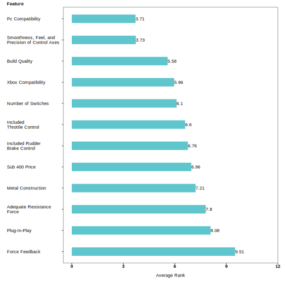

# Market Validation Report: Flight Simulation Yoke Controller

## Background

This repository aims to summarize research results from an exploratory analysis on the outcome of introducing an additional product offering in the flight simulation yoke controller market.The proposed product has one main advantage over current market offerings, which we aim to test: an increased perceived feel, smoothness, and precision of yoke movement at a price point under $400. Our main product competitors we outlined for this analysis is the Turtle Beach: VelocityOne, Honeycomb XPC, and the Thrustmaster TCA Boeing. Given this, we set out to answer 3 key questions in an attempt to validate a market for this product:

##### *RQ 1: Understand whether users of flight simulation yokes perceive feel, smoothness, and precision issues in current market offerings.​*
##### *RQ 2: Determine the value users place on the feel, smoothness, and precision of a flight yoke relative to other features.​*
##### *RQ 3: Assess the comparative desirability of the current product against its primary competitors.​*

## Conclusions & Key Findings 

##### *RQ 1: Understand whether users of flight simulation yokes perceive feel, smoothness, and precision issues in current market offerings.​*
- Analysis results find that a considerable amount of customer reviews (30%) and survey respondents (45%-55%) for the Turtle Beach and Honeycomb yoes contain or claim issues with smoothness, feel, and precion of pitch mechanism.
- To a lesser degree, the analysis finds that 10% of customer reviews and 36% of survey respondents of the Thrustmaster Yoke contain or claim issues with smoothness, feel, and precion of pitch mechanism.
- Findings between the customer review analysis and survey analysis are consistent in the Thrustmaster having a higher satisfaction regarding yoke smoothness compared to the other competitors. This makes sense given the Thrustmaster yoke mechanism is pendular rather than linear, and not succesiptable to smoothness issues. 
  -  This findings highlight that our proposed product is not as much of a direct compeitor to the thrustmaster as it is to the honeycomb and Turtle Beach yokes. This makes sense given that our product and the honeycomb and turtle beach yokes both share a linear mechanism and that the thrustmaster yoke is particularly positioned to mimic a Boeing aircrafts yoke and for enthusiasts of Boeing aircraft, while the other competitors are general to most aircraft.
-  Dissatisfaction with feel, smoothness, and precision were found higher in the survey results than the customer reviews consistent across each of the products. This reveals the discrepency vs what users feel regarding feature when asked to think criticly about its drawbacks in the survey question vs what the most significant issues are as it relates to the product in the reviews.   
##### *RQ 2: Determine the value users place on the feel, smoothness, and precision of a flight yoke relative to other features.​*
##### *RQ 3: Assess the comparative desirability of the current product against its primary competitors.​*

## Methods & Data Processing
Our methodological approach to answering these questions included data sources in customer product reviews and survey data

### Product Reviews 
Web-scraped 306 customer reviews (3 stars or under) from Amazon, Walmart, Best Buy and other popular retailers​

Sample breakdown for each yoke:​
- Turtle Beach Velocity One (n=174) ​
- Honeycomb Aeronautical XPC (n=82)​
- Thrustmaster TCA Boeing (n=50)

For more detailed information on the analysis plan and data processing, please review this code file and readme:
[Product Review Data Processing & Analysis](https://github.com/sufiyan-syed0921/market-validation-fsy/tree/main/product_reviews)

### Survey
Surveyed approximately 300 yoke users on the r/flightsim subreddit using Qualtrics​. Users who took the survey were entered into a raffle for a $100 Steam gift card​. 

Responses were filtered out of the final analysis for 2 key reasons: 
- **Yoke Ownership:**
Users who do not own a flight yoke, or those who quit the survey after indicating yoke ownership, were removed.
- **Inconconsitent Location Responses:**
Respondents were asked if they are local to the SF Bay Area. If so, respondents were further asked if they would be interested in participating in an in-person user study. We received a significant number of responses claiming to be local to the SF Bay Area while having IP addresses far outside the SF Bay Area which raised concerns of untruthful responses. These responses were removed from the sample.​

After these filters, the post-processed sample size for the survey data was 157. 

For more detailed information on the analysis plan and data processing, please review this code file and readme:
[Survey Data Processing & Analysis](https://github.com/sufiyan-syed0921/market-validation-fsy/tree/main/survey)

## Results 

### RQ 1: Understand whether users of flight simulation yokes perceive feel, smoothness, and precision issues in current market offerings.​

  <h4>Amazon Reviews</h4>

  

  <h4>Survey Question</h4>

### RQ 2: Determine the value users place on the feel, smoothness, and precision of a flight yoke relative to other features.​

- Feature Ranking

### RQ 3: Assess the comparative desirability of the current product against its primary competitors.​

- Product Ranking

### Limitations

#### *Exploratory Findings*
  - Findings are exploratory and may not be representative of the broader market.

#### *Sampling Bias*
  - Product Review data is drawn primarily from Amazon via web scraping. Amazon’s platform only displays up to 100 reviews per filter, which may skew sample representation.
  - Customers posting reviews are self-selecting, and those with strong negative or to a lesser degree positive opinions are more likely to leave reviews. This may result in bias toward more extreme sentiment.  
  - The survey sample is limited to Reddit users from r/flightsim, which likely overrepresents niche and enthusiast flight simulator users rather than casual consumers
  - Respondents were self-selected and may have been influenced by the incentive to participate, introducing potential bias.

#### *Subjectivity of pitch quality*
  - The perceived smoothness, feel, and precision of a yoke’s pitch axis is subjective and vary by user. Differences in this quality are difficult to describe explicitly when creating measures.

#### *Does Not Reflect Post-Review Product Changes*
  - The analysis reflects customer experiences tied to specific product iterations at the time of the review. Subsequent updates or redesigns are not captured.

#### *Instrumentation Bias*
  - Due to a Qualtrics configuration issue, feature and yoke ranking questions were not randomized, possibly biasing responses based on the default item order.

